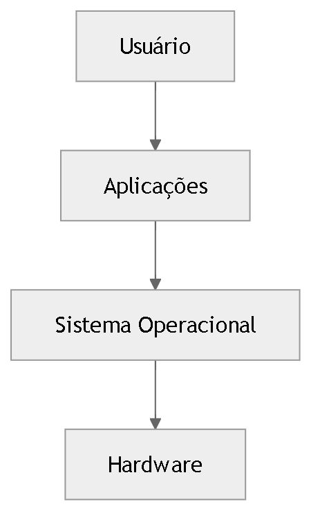
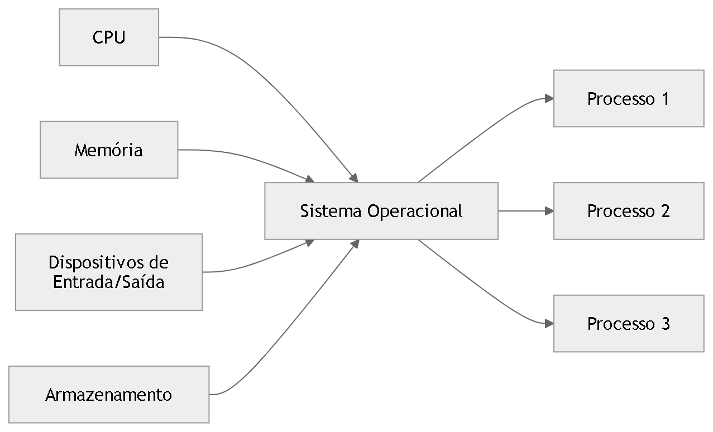
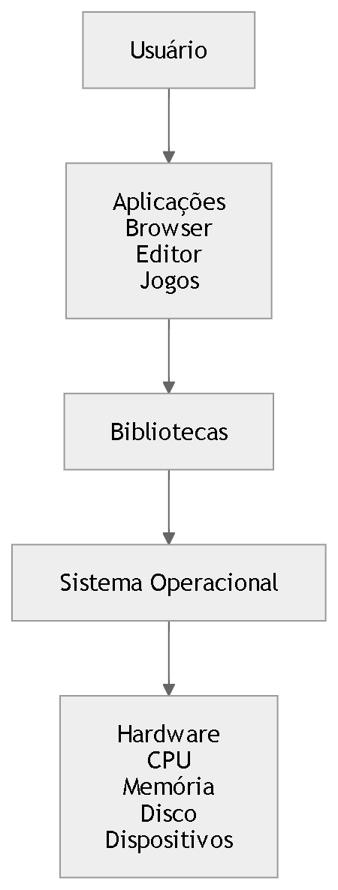

📚 Introdução aos Sistemas Operacionais

Os sistemas operacionais são responsáveis por intermediar a comunicação entre o hardware e os programas, fornecendo abstrações que simplificam o uso do computador.

Eles possuem duas funções principais:

Máquina estendida

Gerenciador de recursos

🧠 Sistema Operacional como Máquina Estendida

O hardware de um computador é complexo.
O sistema operacional cria abstrações simples, como arquivos, processos e memória virtual.

Diagrama conceitual

 

Nesse modelo:

O usuário interage com aplicações

As aplicações usam serviços do sistema operacional

O sistema operacional controla o hardware

⚙️ Sistema Operacional como Gerenciador de Recursos

O sistema operacional organiza o uso de:

CPU

memória

dispositivos de entrada e saída

armazenamento

Diagrama de gerenciamento de recursos

 

O sistema operacional decide:

quem usa cada recurso

por quanto tempo

Esse processo é chamado escalonamento.

🧩 Estrutura em Camadas do Computador

Computadores podem ser representados em camadas de abstração.

 

Cada camada simplifica a camada abaixo.

🔐 Modo Usuário vs Modo Kernel

Processadores modernos possuem dois modos de execução:

Modo usuário

Modo kernel

Diagrama

Fluxo:

Programa solicita serviço

O pedido vira system call

O kernel executa a operação

O hardware realiza a ação

🧱 Arquitetura Interna do Sistema Operacional

Um sistema operacional pode possuir vários componentes.

Cada módulo possui uma responsabilidade específica.

📜 Gerações de Computadores

A evolução dos sistemas operacionais acompanha a evolução do hardware.

Geração	Período	Tecnologia	Características	Sistemas
Primeira	1945–1955	Válvulas	Programação manual	Sem sistema operacional
Segunda	1955–1965	Transistores	Sistemas em lote	Monitores batch
Terceira	1965–1980	Circuitos integrados	Multiprogramação	MULTICS
Quarta	1980–presente	Microprocessadores	PCs e interfaces gráficas	Windows, Unix
Quinta	1990–presente	Dispositivos móveis e redes	Sistemas distribuídos	Linux, Android
🖥️ Evolução Histórica Simplificada
🎯 Ideia central

Os sistemas operacionais resolvem três grandes problemas da computação:

Complexidade do hardware

Compartilhamento de recursos

Execução segura de programas

Eles fazem isso através de:

abstrações

gerenciamento de recursos

controle de execução
