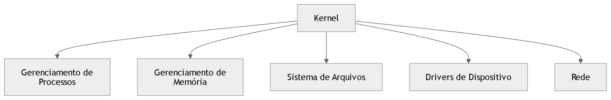
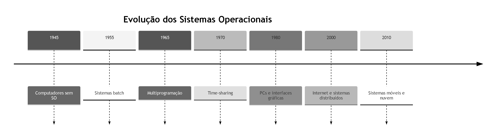

📚 Introdução aos Sistemas Operacionais

Os sistemas operacionais são responsáveis por intermediar a comunicação entre o hardware e os programas, fornecendo abstrações que simplificam o uso do computador.

Eles possuem duas funções principais:

Máquina estendida

Gerenciador de recursos

🧠 Sistema Operacional como Máquina Estendida

O hardware de um computador é complexo.
O sistema operacional cria abstrações simples, como arquivos, processos e memória virtual.

Diagrama conceitual

 

Nesse modelo:

O usuário interage com aplicações

As aplicações usam serviços do sistema operacional

O sistema operacional controla o hardware

⚙️ Sistema Operacional como Gerenciador de Recursos

O sistema operacional organiza o uso de:

CPU

memória

dispositivos de entrada e saída

armazenamento

Diagrama de gerenciamento de recursos

 

O sistema operacional decide:

quem usa cada recurso

por quanto tempo

Esse processo é chamado escalonamento.

🧩 Estrutura em Camadas do Computador

Computadores podem ser representados em camadas de abstração.

 

Cada camada simplifica a camada abaixo.

🔐 Modo Usuário vs Modo Kernel

Processadores modernos possuem dois modos de execução:

Modo usuário

Modo kernel

Diagrama

 .png)

Fluxo:

Programa solicita serviço

O pedido vira system call

O kernel executa a operação

O hardware realiza a ação

🧱 Arquitetura Interna do Sistema Operacional

Um sistema operacional pode possuir vários componentes.

 

Cada módulo possui uma responsabilidade específica.

📜 Gerações de Computadores

A evolução dos sistemas operacionais acompanha a evolução do hardware.

| Geração  | Período       | Tecnologia                  | Características           | Sistemas                |
| -------- | ------------- | --------------------------- | ------------------------- | ----------------------- |
| Primeira | 1945–1955     | Válvulas                    | Programação manual        | Sem sistema operacional |
| Segunda  | 1955–1965     | Transistores                | Sistemas em lote          | Monitores batch         |
| Terceira | 1965–1980     | Circuitos integrados        | Multiprogramação          | MULTICS                 |
| Quarta   | 1980–presente | Microprocessadores          | PCs e interfaces gráficas | Windows, Unix           |
| Quinta   | 1990–presente | Dispositivos móveis e redes | Sistemas distribuídos     | Linux, Android          |

🖥️ Evolução Histórica Simplificada

 

🎯 Ideia central

Os sistemas operacionais resolvem três grandes problemas da computação:

Complexidade do hardware

Compartilhamento de recursos

Execução segura de programas

Eles fazem isso através de:

abstrações

gerenciamento de recursos

controle de execução

Resumo:

# Resumo – Introdução aos Sistemas Operacionais

1. Um sistema operacional é um software fundamental.
2. Ele controla o funcionamento do computador.
3. Atua como intermediário entre hardware e programas.
4. Permite que usuários utilizem o computador de forma simples.
5. Sem sistema operacional o uso do hardware seria complexo.
6. O hardware inclui CPU, memória e dispositivos de entrada e saída.
7. O sistema operacional organiza o uso desses recursos.
8. Ele garante que vários programas possam funcionar juntos.
9. O sistema operacional é essencial para a computação moderna.
10. Ele fornece abstrações para facilitar a programação.

11. Abstrações escondem detalhes complexos do hardware.
12. Arquivos são um exemplo clássico de abstração.
13. Um arquivo representa dados armazenados em disco.
14. O programador não precisa conhecer detalhes do disco.
15. O sistema operacional gerencia esses detalhes.
16. Diretórios organizam arquivos.
17. O sistema operacional também gerencia diretórios.
18. Ele permite leitura e escrita de dados.
19. Essas operações são simplificadas.
20. O objetivo é tornar o computador mais fácil de usar.

21. Outra função do sistema operacional é gerenciar recursos.
22. Recursos incluem CPU.
23. Recursos incluem memória.
24. Recursos incluem dispositivos de entrada e saída.
25. Muitos programas competem por esses recursos.
26. O sistema operacional decide quem usa o recurso.
27. Esse processo é chamado de gerenciamento de recursos.
28. O gerenciamento evita conflitos.
29. O gerenciamento melhora eficiência.
30. O gerenciamento mantém estabilidade do sistema.

31. O sistema operacional pode ser visto como máquina estendida.
32. A máquina estendida simplifica o hardware.
33. O programador vê uma interface mais simples.
34. O sistema operacional traduz comandos.
35. O hardware executa as operações reais.
36. Essa ideia facilita o desenvolvimento de software.
37. Programadores trabalham com conceitos abstratos.
38. Discos aparecem como arquivos.
39. Memória aparece como espaço contínuo.
40. Processos representam programas em execução.

41. Processos são unidades básicas de execução.
42. Um processo possui estado próprio.
43. Um processo possui memória própria.
44. O sistema operacional controla processos.
45. Ele cria processos.
46. Ele encerra processos.
47. Ele coordena múltiplos processos.
48. Isso permite multitarefa.
49. Multitarefa significa vários programas ativos.
50. O sistema alterna rapidamente entre eles.

51. A CPU é um recurso compartilhado.
52. O sistema operacional controla seu uso.
53. Esse controle é chamado escalonamento.
54. Escalonamento decide qual processo executa.
55. O objetivo é usar CPU eficientemente.
56. Também busca justiça entre processos.
57. Alguns processos são mais prioritários.
58. Outros podem esperar mais tempo.
59. Políticas definem regras de escalonamento.
60. Mecanismos implementam essas políticas.

61. O sistema operacional também gerencia memória.
62. Memória é necessária para executar programas.
63. Cada processo precisa de espaço.
64. O sistema aloca memória.
65. O sistema libera memória quando necessário.
66. Também protege memória entre processos.
67. Isso impede que um programa corrompa outro.
68. Essa proteção aumenta segurança.
69. Também aumenta estabilidade.
70. A memória é um recurso limitado.

71. Dispositivos de entrada e saída são gerenciados.
72. Exemplos incluem teclado.
73. Exemplos incluem mouse.
74. Exemplos incluem disco.
75. Exemplos incluem impressora.
76. O sistema operacional controla acesso a dispositivos.
77. Ele organiza filas de uso.
78. Assim evita conflitos.
79. Programas não acessam hardware diretamente.
80. O sistema operacional intermedeia esse acesso.

81. O sistema operacional executa em modo privilegiado.
82. Esse modo é chamado modo kernel.
83. Nesse modo o sistema tem controle total.
84. Programas comuns executam em modo usuário.
85. Modo usuário tem restrições.
86. Essa separação protege o sistema.
87. Instruções perigosas são restritas.
88. Apenas o kernel pode executá-las.
89. Isso evita falhas críticas.
90. Também evita ataques.

91. Chamadas de sistema conectam programas ao kernel.
92. Programas solicitam serviços ao sistema.
93. O kernel executa a operação.
94. Exemplos incluem abrir arquivos.
95. Exemplos incluem criar processos.
96. Exemplos incluem acessar dispositivos.
97. Chamadas de sistema são interfaces fundamentais.
98. Elas definem como programas usam o sistema.
99. Cada sistema operacional define suas chamadas.
100. Elas formam uma API básica do sistema.

101. Interfaces permitem interação com usuários.
102. Interfaces podem ser gráficas.
103. Interfaces podem ser textuais.
104. Interfaces textuais usam comandos.
105. Interfaces gráficas usam janelas e ícones.
106. Ambas dependem do sistema operacional.
107. O kernel fornece os serviços principais.
108. Interfaces usam esses serviços.
109. Usuários raramente interagem diretamente com o kernel.
110. Normalmente usam aplicações.

111. Aplicações utilizam bibliotecas.
112. Bibliotecas usam chamadas de sistema.
113. Assim aplicações acessam recursos do sistema.
114. Esse modelo cria camadas.
115. Camadas organizam o software.
116. Hardware está na base.
117. Sistema operacional fica acima do hardware.
118. Aplicações ficam acima do sistema.
119. Usuários interagem com aplicações.
120. Essa organização facilita o design.

121. A história dos sistemas operacionais acompanha hardware.
122. Primeiros computadores não tinham sistemas operacionais.
123. Programadores controlavam hardware diretamente.
124. Isso era difícil.
125. Também era lento.
126. Cada programa exigia configuração manual.
127. Cartões perfurados eram usados.
128. Programas eram carregados manualmente.
129. O processo era demorado.
130. A eficiência era baixa.

131. A segunda geração introduziu transistores.
132. Computadores ficaram mais confiáveis.
133. Surgiram sistemas em lote.
134. Programas eram executados em sequência.
135. Operadores preparavam lotes de tarefas.
136. O computador executava todos automaticamente.
137. Isso reduziu tempo ocioso.
138. Monitores de lote surgiram.
139. Eles controlavam execução de programas.
140. Esses monitores evoluíram para sistemas operacionais.

141. A terceira geração trouxe circuitos integrados.
142. Computadores ficaram mais poderosos.
143. Surgiu multiprogramação.
144. Vários programas podiam ficar na memória.
145. Quando um programa esperava E/S outro executava.
146. Isso aumentou eficiência.
147. Também surgiu tempo compartilhado.
148. Usuários interagiam com terminais.
149. Muitos usuários usavam o computador simultaneamente.
150. O sistema dividia tempo da CPU.

151. Sistemas complexos surgiram nessa época.
152. Um exemplo foi MULTICS.
153. MULTICS introduziu muitas ideias modernas.
154. Influenciou sistemas posteriores.
155. Também influenciou UNIX.
156. UNIX tornou-se muito importante.
157. Ele inspirou muitos sistemas atuais.
158. Sua filosofia influenciou engenharia de software.
159. Modularidade foi valorizada.
160. Simplicidade também foi valorizada.

161. A quarta geração trouxe microprocessadores.
162. Computadores pessoais surgiram.
163. Computadores ficaram menores.
164. Também ficaram mais baratos.
165. Sistemas operacionais para PCs apareceram.
166. Interfaces gráficas tornaram-se populares.
167. Usuários comuns passaram a usar computadores.
168. Sistemas operacionais precisaram evoluir.
169. Facilidade de uso tornou-se prioridade.
170. Compatibilidade também se tornou importante.

171. Redes de computadores cresceram.
172. Sistemas operacionais passaram a suportar redes.
173. Compartilhamento de arquivos tornou-se comum.
174. Comunicação entre máquinas tornou-se essencial.
175. Protocolos de rede foram integrados.
176. A internet impulsionou novos sistemas.
177. Sistemas distribuídos ganharam importância.
178. Computação em rede tornou-se padrão.
179. Servidores e clientes interagem constantemente.
180. O sistema operacional coordena essa interação.

181. Sistemas móveis surgiram posteriormente.
182. Smartphones exigiram novos sistemas.
183. Tablets também exigiram novos sistemas.
184. Eficiência energética tornou-se essencial.
185. Dispositivos móveis usam baterias.
186. O sistema precisa economizar energia.
187. Sensores também são integrados.
188. GPS é um exemplo.
189. Câmeras também são sensores importantes.
190. Sistemas móveis gerenciam esses recursos.

191. A computação continua evoluindo.
192. Novos dispositivos aparecem.
193. Internet das coisas é um exemplo.
194. Dispositivos pequenos executam sistemas operacionais.
195. Muitos usam sistemas derivados de UNIX.
196. Sistemas precisam ser confiáveis.
197. Também precisam ser seguros.
198. Segurança tornou-se prioridade.
199. Sistemas modernos incorporam proteção avançada.
200. O estudo de sistemas operacionais continua relevante.

201. Sistemas operacionais são base da computação.
202. Eles conectam software e hardware.
203. Sem eles o desenvolvimento seria difícil.
204. Eles permitem abstrações poderosas.
205. Também organizam recursos limitados.
206. Isso melhora eficiência geral.
207. Programadores dependem dessas abstrações.
208. Usuários dependem da estabilidade.
209. Sistemas operacionais evoluem constantemente.
210. Eles refletem avanços tecnológicos.

211. O conceito de processo permanece central.
212. O conceito de memória protegida é fundamental.
213. O conceito de gerenciamento de dispositivos é essencial.
214. Esses conceitos formam a base dos sistemas.
215. Arquiteturas podem variar.
216. Implementações podem variar.
217. Mas princípios permanecem semelhantes.
218. Abstração é sempre importante.
219. Gerenciamento de recursos também.
220. Segurança também é fundamental.

221. Sistemas modernos são altamente complexos.
222. Milhões de linhas de código podem existir.
223. O kernel é parte central.
224. Mas muitos serviços ficam fora dele.
225. Utilitários ajudam na administração.
226. Ferramentas auxiliam usuários.
227. Bibliotecas facilitam programação.
228. Camadas organizam a arquitetura.
229. Essa organização reduz complexidade.
230. Também melhora manutenção.

231. O design de sistemas operacionais envolve engenharia.
232. É necessário equilíbrio entre desempenho e simplicidade.
233. Também entre segurança e flexibilidade.
234. Decisões arquiteturais são importantes.
235. Algumas arquiteturas usam kernels monolíticos.
236. Outras usam microkernels.
237. Cada abordagem tem vantagens.
238. Cada abordagem tem desvantagens.
239. O estudo dessas abordagens é importante.
240. Ele ajuda a compreender sistemas reais.

241. Sistemas operacionais são invisíveis para muitos usuários.
242. Mesmo assim são essenciais.
243. Eles permitem que computadores funcionem corretamente.
244. Eles coordenam todos os componentes.
245. Hardware isolado não é suficiente.
246. Software precisa de gerenciamento.
247. O sistema operacional fornece esse gerenciamento.
248. Ele organiza recursos.
249. Ele protege dados.
250. Ele permite execução de programas.

251. Sistemas operacionais evoluem junto com tecnologia.
252. Novos desafios surgem continuamente.
253. Computação paralela é um exemplo.
254. Computação distribuída é outro exemplo.
255. Sistemas precisam lidar com múltiplos núcleos.
256. Precisam lidar com grandes volumes de dados.
257. Precisam lidar com redes globais.
258. Cada avanço exige novos mecanismos.
259. O estudo contínuo é necessário.
260. A pesquisa nessa área continua ativa.

261. Sistemas operacionais continuam sendo área central da computação.
262. Eles conectam teoria e prática.
263. Conceitos fundamentais permanecem relevantes.
264. Abstração continua essencial.
265. Gerenciamento de recursos continua essencial.
266. Segurança continua essencial.
267. Desempenho continua essencial.
268. Escalabilidade continua essencial.
269. Confiabilidade continua essencial.
270. Disponibilidade continua essencial.

271. Sistemas operacionais tornam computadores utilizáveis.
272. Eles simplificam interação humana.
273. Eles tornam programação viável.
274. Eles controlam hardware complexo.
275. Eles permitem multitarefa.
276. Eles permitem compartilhamento.
277. Eles permitem comunicação.
278. Eles permitem armazenamento organizado.
279. Eles permitem execução confiável.
280. Eles sustentam toda infraestrutura digital.

281. Cada computador moderno depende de um sistema operacional.
282. Mesmo dispositivos pequenos possuem algum sistema.
283. Sistemas embarcados também utilizam kernels.
284. Esses sistemas podem ser simples.
285. Outros podem ser extremamente complexos.
286. Mas todos seguem princípios semelhantes.
287. Gerenciar recursos.
288. Fornecer abstrações.
289. Controlar execução.
290. Proteger o sistema.

291. O estudo de sistemas operacionais revela como computadores funcionam.
292. Ele mostra como hardware é controlado.
293. Também mostra como software interage com hardware.
294. Isso é essencial para engenheiros de software.
295. Também para engenheiros de sistemas.
296. Também para desenvolvedores de baixo nível.
297. Compreender esses conceitos amplia habilidades.
298. Permite projetar sistemas melhores.
299. Permite otimizar desempenho.
300. Permite construir soluções robustas.

301. Sistemas operacionais são a base da computação moderna.
302. Eles conectam aplicações e hardware.
303. Eles permitem que usuários realizem tarefas complexas.
304. Eles gerenciam milhões de operações por segundo.
305. Tudo isso ocorre de forma transparente.
306. Usuários raramente percebem.
307. Mas cada ação depende do sistema.
308. Abrir um arquivo depende do sistema.
309. Executar um programa depende do sistema.
310. Acessar internet depende do sistema.

311. Sistemas operacionais evoluíram por décadas.
312. Cada geração trouxe melhorias.
313. Desempenho aumentou.
314. Confiabilidade aumentou.
315. Segurança tornou-se mais importante.
316. Interfaces ficaram mais amigáveis.
317. Sistemas tornaram-se mais complexos.
318. Mas também mais poderosos.
319. O futuro trará novos desafios.
320. Sistemas continuarão evoluindo.

321. Computação em nuvem exige novos mecanismos.
322. Virtualização tornou-se comum.
323. Containers também se popularizaram.
324. Sistemas operacionais suportam essas tecnologias.
325. A abstração continua central.
326. Recursos físicos continuam sendo compartilhados.
327. O sistema organiza tudo isso.
328. Ele distribui trabalho.
329. Ele mantém estabilidade.
330. Ele mantém eficiência.

331. Sistemas operacionais são invisíveis mas indispensáveis.
332. Eles sustentam aplicações modernas.
333. Sem eles computadores seriam impraticáveis.
334. Eles representam décadas de pesquisa.
335. Engenharia sofisticada está envolvida.
336. Cada componente do sistema é cuidadosamente projetado.
337. Confiabilidade é fundamental.
338. Segurança é fundamental.
339. Eficiência é fundamental.
340. Esses princípios guiam o design.

341. O estudo dessa área revela estrutura interna dos computadores.
342. Mostra como programas interagem com hardware.
343. Mostra como recursos são controlados.
344. Mostra como sistemas permanecem estáveis.
345. Isso ajuda engenheiros a compreender máquinas.
346. Também ajuda a construir novas tecnologias.
347. O conhecimento é aplicável em muitas áreas.
348. Sistemas embarcados.
349. Computação móvel.
350. Computação em nuvem.

351. Cada uma dessas áreas usa conceitos de sistemas operacionais.
352. Processos continuam sendo importantes.
353. Threads também são importantes.
354. Memória virtual também é importante.
355. Sistemas de arquivos também são importantes.
356. Drivers de dispositivos também são importantes.
357. Todos esses componentes trabalham juntos.
358. O sistema operacional coordena tudo.
359. O resultado é um sistema funcional.
360. Esse sistema sustenta aplicações modernas.

361. Sistemas operacionais são fundamentais na engenharia de software.
362. Eles definem como software interage com hardware.
363. Eles estabelecem interfaces padronizadas.
364. Eles permitem portabilidade de programas.
365. Programas podem rodar em máquinas diferentes.
366. Desde que o sistema operacional forneça mesma interface.
367. Isso simplifica desenvolvimento.
368. Também simplifica manutenção.
369. Também facilita evolução tecnológica.
370. O sistema operacional é base dessa compatibilidade.

371. Muitos sistemas modernos derivam de ideias antigas.
372. Conceitos de UNIX ainda são influentes.
373. Estrutura de processos continua relevante.
374. Sistema de arquivos hierárquico continua comum.
375. Interface de chamadas de sistema continua fundamental.
376. Mesmo sistemas modernos seguem esses princípios.
377. Isso demonstra robustez dessas ideias.
378. Conceitos bem projetados duram décadas.
379. Sistemas operacionais exemplificam isso.
380. Eles evoluem mas preservam fundamentos.

381. O design de sistemas operacionais é um campo ativo.
382. Pesquisadores exploram novas arquiteturas.
383. Desempenho continua sendo desafio.
384. Escalabilidade também.
385. Segurança é preocupação crescente.
386. Ataques modernos são sofisticados.
387. Sistemas precisam se defender.
388. Novos mecanismos são desenvolvidos.
389. A evolução continua.
390. O estudo continua relevante.

391. Sistemas operacionais continuam sendo base de toda computação.
392. Eles organizam recursos complexos.
393. Eles simplificam programação.
394. Eles garantem funcionamento confiável.
395. Eles permitem multitarefa.
396. Eles permitem comunicação.
397. Eles permitem armazenamento estruturado.
398. Eles permitem execução segura.
399. Sem eles computadores seriam difíceis de usar.
400. Eles tornam a tecnologia acessível.

401. Cada dispositivo moderno depende deles.
402. Computadores pessoais dependem deles.
403. Smartphones dependem deles.
404. Servidores dependem deles.
405. Dispositivos embarcados dependem deles.
406. Sistemas industriais dependem deles.
407. Infraestruturas críticas dependem deles.
408. Eles são invisíveis mas essenciais.
409. A computação moderna não existiria sem eles.
410. Eles são a base da infraestrutura digital.

411. Sistemas operacionais conectam software e hardware.
412. Essa conexão é fundamental.
413. Sem ela programas não poderiam executar.
414. O sistema controla tudo.
415. Ele gerencia CPU.
416. Ele gerencia memória.
417. Ele gerencia dispositivos.
418. Ele coordena execução.
419. Ele protege dados.
420. Ele mantém ordem.

421. O estudo de sistemas operacionais revela arquitetura interna dos computadores.
422. Ajuda programadores a compreender limites do hardware.
423. Ajuda engenheiros a projetar sistemas eficientes.
424. Ajuda pesquisadores a inovar.
425. O conhecimento adquirido é profundo.
426. Ele conecta teoria e prática.
427. Ele mostra como computadores realmente funcionam.
428. Ele mostra como sistemas são organizados.
429. Ele mostra como software controla máquinas.
430. Esse conhecimento é essencial.

431. Sistemas operacionais são pilares da computação.
432. Eles sustentam toda infraestrutura digital.
433. Cada avanço tecnológico depende deles.
434. Eles evoluem constantemente.
435. Eles acompanham mudanças no hardware.
436. Eles acompanham mudanças na sociedade.
437. Eles acompanham mudanças na internet.
438. Eles acompanham novas formas de computação.
439. O campo continua crescendo.
440. Novos desafios continuam surgindo.

441. Computação quântica pode exigir novos sistemas.
442. Inteligência artificial exige grande poder computacional.
443. Sistemas operacionais precisam suportar essas demandas.
444. Isso exige novas pesquisas.
445. Novas arquiteturas podem surgir.
446. Mas princípios fundamentais permanecem.
447. Abstração.
448. Gerenciamento de recursos.
449. Proteção.
450. Eficiência.

451. Esses princípios definem o núcleo da área.
452. Eles guiam desenvolvimento de sistemas.
453. Eles ajudam a compreender sistemas existentes.
454. Eles ajudam a projetar novos sistemas.
455. Sistemas operacionais são ciência e engenharia.
456. Eles unem teoria e prática.
457. Eles unem hardware e software.
458. Eles unem eficiência e confiabilidade.
459. Eles são fundamentais para a computação.
460. Seu estudo é indispensável.

461. A computação moderna depende deles.
462. A internet depende deles.
463. Aplicações dependem deles.
464. Usuários dependem deles.
465. Empresas dependem deles.
466. Infraestruturas dependem deles.
467. Eles sustentam o mundo digital.
468. Seu impacto é enorme.
469. Seu papel é central.
470. Seu estudo é essencial.

471. Sistemas operacionais representam décadas de inovação.
472. Muitos pesquisadores contribuíram.
473. Muitas ideias evoluíram.
474. O campo continua ativo.
475. Novos sistemas continuam sendo desenvolvidos.
476. A tecnologia continuará evoluindo.
477. Sistemas operacionais evoluirão com ela.
478. O estudo dessa área continua importante.
479. Ele revela como computadores funcionam.
480. Ele prepara engenheiros para novos desafios.

481. Sistemas operacionais são essenciais.
482. Eles simplificam computadores complexos.
483. Eles organizam recursos.
484. Eles protegem dados.
485. Eles permitem execução eficiente.
486. Eles tornam a computação possível.
487. Eles sustentam tecnologia moderna.
488. Eles evoluem continuamente.
489. Eles permanecem fundamentais.
490. Eles continuarão existindo.

491. Computadores dependem deles.
492. Programadores dependem deles.
493. Usuários dependem deles.
494. Infraestruturas dependem deles.
495. Sistemas operacionais são pilares da computação.
496. Seu estudo revela fundamentos da tecnologia.
497. Seu impacto é profundo.
498. Seu papel é central.
499. Seu desenvolvimento continua.
500. Sistemas operacionais são a base da computação moderna.
