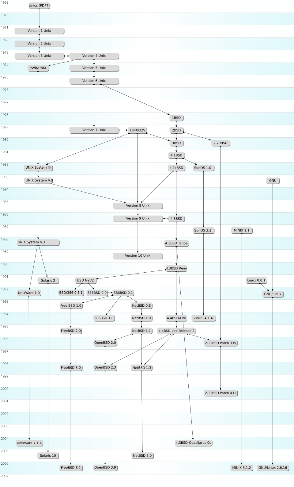
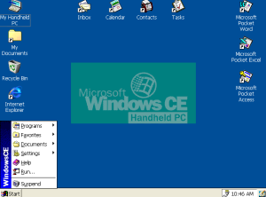
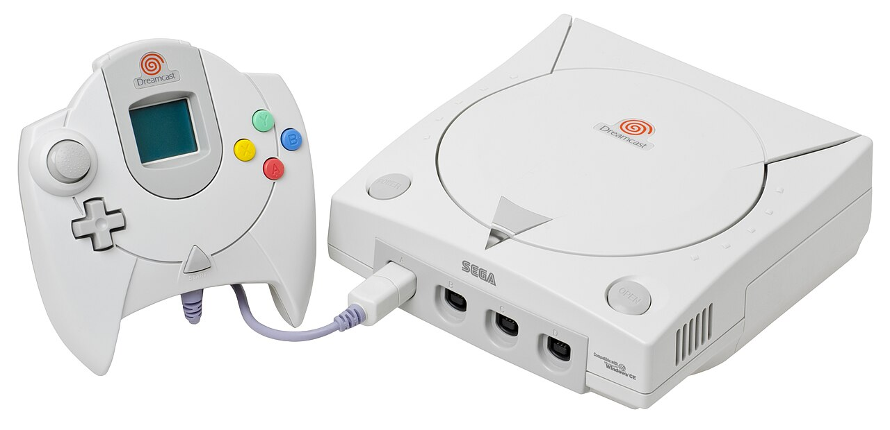
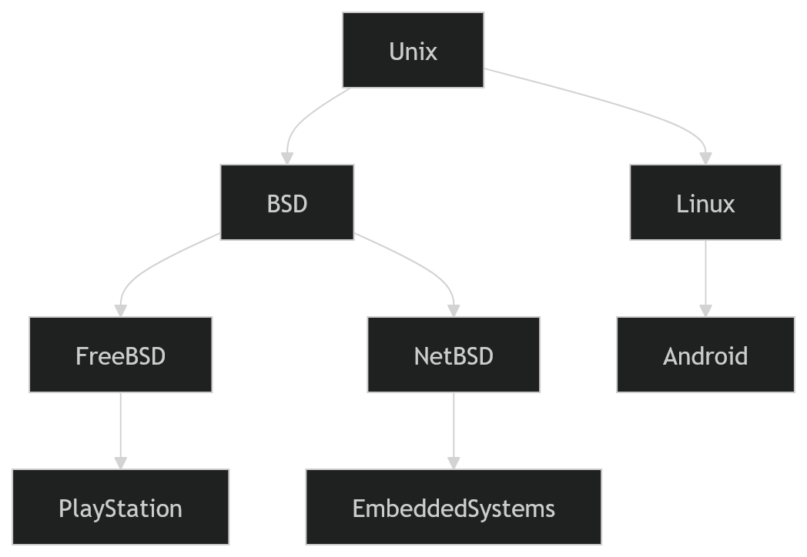

🌌 A Evolução dos Kernels
Sistemas Operacionais, Consoles e a Árvore da Computação

    Uma jornada entre ciência da computação e retrogames.

🧠 O que é um Kernel?

O kernel é o núcleo de um sistema operacional.

Ele controla:

    CPU

    memória

    dispositivos

    processos

    comunicação entre programas

Diagrama conceitual

+-----------------------+
|     Aplicações        |
+-----------------------+
| Bibliotecas / APIs    |
+-----------------------+
| Sistema Operacional   |
+-----------------------+
|        KERNEL         |
+-----------------------+
|       Hardware        |
+-----------------------+

O kernel é basicamente o mediador entre software e hardware.
🌳 A árvore genealógica dos sistemas

Grande parte dos sistemas modernos descende de Unix.

Isso gerou uma enorme árvore evolutiva de sistemas operacionais.
Diagrama simplificado
                 UNIX
                  |
      +-----------+-----------+
      |                       |
     BSD                    System V
      |                       |
+-----+-----+          +------+------+
|           |          |             |
FreeBSD   NetBSD     Solaris       AIX
  |                         |
  |                         |
PlayStation OS          servidores
Nintendo Switch

Muitos sistemas atuais pertencem à família Unix-like, incluindo BSD e Linux. 

 

 1969 ─ Unix criado nos Bell Labs
1977 ─ BSD surge na Universidade de Berkeley
1981 ─ MS-DOS domina PCs
1991 ─ Linux criado por Linus Torvalds
1993 ─ FreeBSD lançado
1996 ─ XNU (kernel do macOS) criado
2000 ─ Consoles começam a usar sistemas complexos
2010 ─ Consoles modernos usam kernels Unix-like
2020 ─ sistemas híbridos dominam (Linux/BSD/Windows)

Consoles e sistemas operacionais

Consoles começaram sem sistema operacional.
Era 8-bit

Exemplo:

    NES

    Master System

Arquitetura:

Cartucho
   ↓
CPU
   ↓
Hardware gráfico

O jogo controlava tudo diretamente.

Isso é chamado de:

bare metal programming

🪐 Era 32-bit — surgem mini-kernels

Consoles começaram a usar bibliotecas internas.

Exemplo:

    PlayStation

    Nintendo 64

    Sega Saturn

Arquitetura típica:

Jogo
 ↓
SDK do console
 ↓
Kernel mínimo
 ↓
Hardware

🌀 Dreamcast e Windows CE

O Dreamcast podia rodar jogos com suporte ao Windows CE.

Isso facilitava portar jogos de PC para o console.

Diagrama:

         Jogo
          ↓
      DirectX APIs
          ↓
      Windows CE
          ↓
     Dreamcast SDK
          ↓
       Hardware

       Alguns jogos utilizavam bibliotecas do Windows CE para facilitar conversão de software de PC para Dreamcast. 

      
       
    
    🧬 Consoles modernos

Hoje os consoles usam kernels derivados de Unix ou Windows.

Exemplo simplificado:

           Game Engine
        (Unreal / Unity)
               ↓
            SDK
               ↓
        Console OS
               ↓
            Kernel
               ↓
            Hardware

            🧠 Metáfora lúdica

Imagine que cada kernel é um motor de nave espacial.

            KERNEL
              |
      +-------+-------+
      |               |
   Sistema A       Sistema B
   (console)        (servidor)

   O motor é o mesmo, mas a nave é diferente.

   🧩 Fluxograma da evolução

   Bare Metal (1980)
      ↓
Mini Kernels (1990)
      ↓
Console OS Proprietário
      ↓
Unix / BSD base
      ↓
Sistemas híbridos modernos

 Aplicação em projetos modernos

Computação
│
├─ Hardware
│   ├─ CPU
│   ├─ GPU
│   └─ Memória
│
├─ Kernel
│   ├─ Processos
│   ├─ Memória
│   └─ Drivers
│
└─ Sistemas
    ├─ Linux
    ├─ BSD
    ├─ Windows
    └─ Consoles

 
