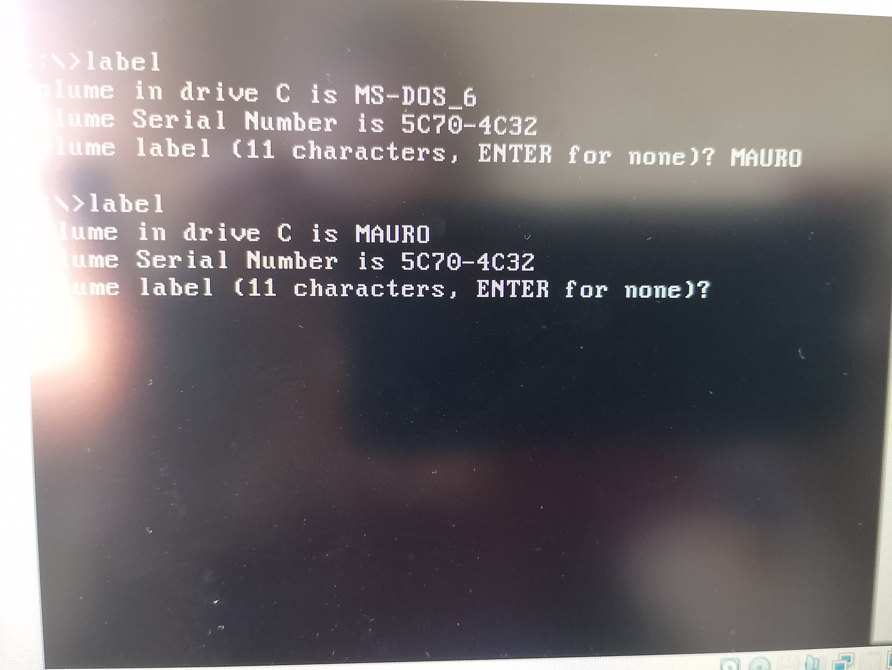
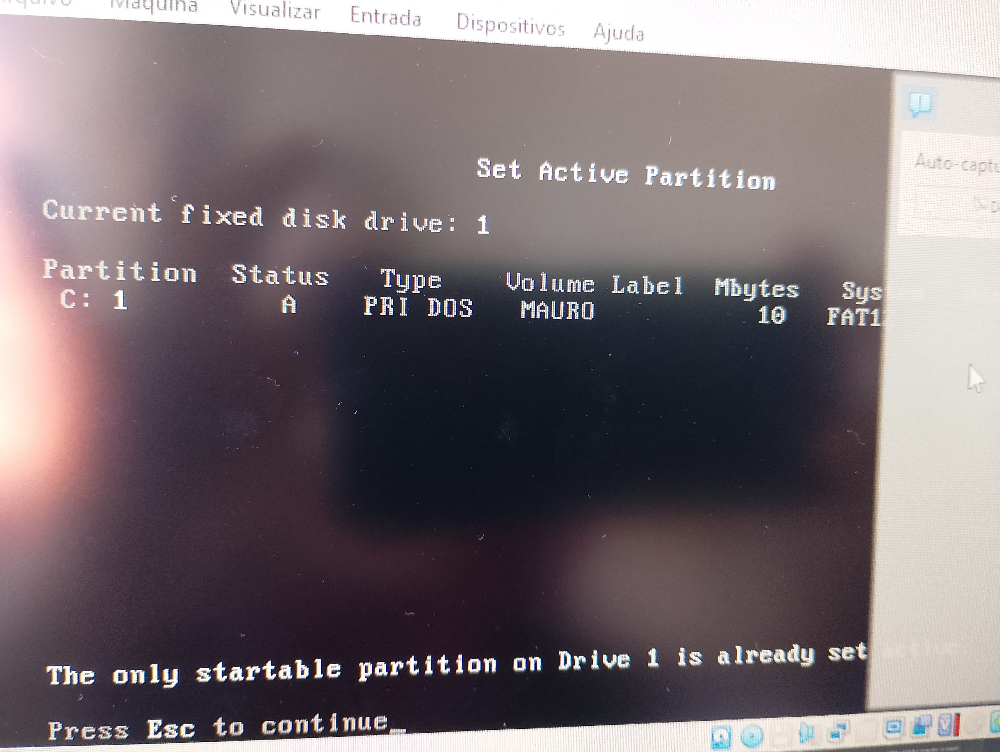
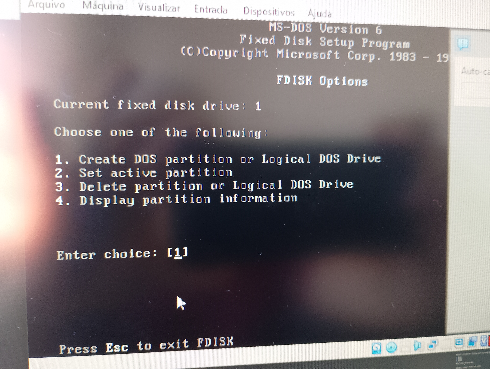

# MS-DOS 6.22 no VirtualBox

Guia completo para instalar **MS-DOS 6.22** em uma máquina virtual usando o **Oracle VirtualBox**.

Este documento foi criado para fins educacionais, permitindo explorar:

- arquitetura de sistemas  
- história da computação  
- programação de baixo nível  
- sistemas operacionais clássicos  

O objetivo é criar um **ambiente funcional de DOS dentro de uma máquina virtual moderna**.


---

---
# Sumário

1. Visão geral
2. Requisitos
3. Download do MS-DOS
4. Instalação do VirtualBox
5. Criação da máquina virtual
6. Configuração de armazenamento
7. Inicialização da VM
8. Criação da partição com FDISK
9. Formatação do disco
10. Instalação do sistema
11. Reinicialização
12. Testando o sistema
13. Estrutura final do sistema
14. Próximos passos

---

# 1. Visão geral

O **MS-DOS 6.22**, lançado em 1994, foi uma das versões mais populares do DOS.

Características principais:

- Interface baseada em linha de comando
- Sistema de arquivos FAT16
- Execução direta de programas `.COM` e `.EXE`
- Controle direto de hardware

Requisitos originais do sistema:

| Recurso | Requisito |
|------|------|
CPU | 8088 ou superior |
RAM | 512 KB |
Disco | ~5 MB |

Hoje ele pode ser executado facilmente em uma máquina virtual.

---

# 2. Requisitos

Antes de iniciar o processo, você precisará de:

- VirtualBox instalado
- imagens do MS-DOS 6.22
- cerca de **200 MB de espaço livre**

---

# 3. Download do MS-DOS 6.22

Um dos repositórios mais confiáveis de software histórico é:

```
https://winworldpc.com/product/ms-dos/622
```

Baixe a versão:

```
Microsoft MS-DOS 6.22 (3.5 - 1.44MB)
```

Após o download você terá três imagens de disquete:

```
Disk1.img
Disk2.img
Disk3.img
```

Esses arquivos representam os **disquetes originais de instalação**.

---

# 4. Instalação do VirtualBox

Site oficial:

```
https://www.virtualbox.org
```

Passos:

1. Baixe o instalador
2. Execute o arquivo
3. Clique em **Next**
4. Aceite os componentes padrão
5. Finalize a instalação

Abra o VirtualBox após a instalação.

---

# 5. Criando a máquina virtual

Clique em:

```
New
```

Configure:

| Parâmetro | Valor |
|------|------|
Name | MS-DOS 6.22 |
Type | Other |
Version | DOS |

Memória:

```
16 MB
```

Criação do disco:

```
Create Virtual Hard Disk
```

Configuração do disco:

| Opção | Valor |
|------|------|
Tipo | VDI |
Alocação | Dynamically Allocated |
Tamanho | 500 MB |

Observação:

O DOS suporta até **2 GB de partição**, então 500 MB funciona perfeitamente.

---

# 6. Configurando armazenamento

Abra:

```
Settings → Storage
```

Adicione um **Floppy Controller**.

Depois:

```
Add Floppy Disk
```

Selecione:

```
Disk1.img
```

---

# 7. Inicializando a máquina

Clique em:

```
Start
```

A VM iniciará pelo disquete.

Você verá algo parecido com:

```
Microsoft MS-DOS Setup
```

Pressione:

```
ENTER
```

---

# 8. Criando partição com FDISK

Se aparecer o prompt:

```
A:\>
```

Digite:

```
FDISK
```

Escolha:

```
1 - Create DOS Partition
```

Depois:

```
1 - Primary DOS Partition
```

Use **100% do disco**.

Após isso:

```
Reinicie a máquina virtual
```

---

# 9. Formatando o disco

Depois de reiniciar:

```
FORMAT C: /S
```

Explicação:

| Comando | Função |
|------|------|
FORMAT | formata o disco |
C: | unidade |
/S | copia arquivos de sistema |

Ao final será pedido um nome para o volume.

Exemplo:

```
DOS622
```

---

# 10. Instalando o sistema

Execute:

```
SETUP
```

Durante a instalação o sistema pedirá os disquetes:

1. Disk1
2. Disk2
3. Disk3

Para trocar no VirtualBox:

```
Devices → Floppy → Choose Disk Image
```

Após copiar os arquivos, a instalação será concluída.

---

# 11. Reinicialização

Remova o disquete virtual.

Reinicie a máquina.

O sistema iniciará com:

```
Starting MS-DOS...
```

Prompt final:

```
C:\>
```

Seu sistema está funcionando.

---

# 12. Testando o sistema

Comandos básicos do DOS.

Listar arquivos:

```
DIR
```

Limpar tela:

```
CLS
```

Criar pasta:

```
MD TESTE
```

Entrar na pasta:

```
CD TESTE
```

Voltar:

```
CD ..
```

---

# 13. Estrutura final do sistema

Após a instalação:

```
C:\
│
├── DOS
│   ├── COMMAND.COM
│   ├── FORMAT.COM
│   ├── FDISK.EXE
│   ├── EDIT.COM
│
├── AUTOEXEC.BAT
└── CONFIG.SYS
```

Arquivos importantes:

| Arquivo | Função |
|------|------|
COMMAND.COM | interpretador de comandos |
AUTOEXEC.BAT | script executado ao iniciar |
CONFIG.SYS | configuração do sistema |

---

# 14. Screenshots da instalação

Imagens do processo.








---

# 15. Próximos passos

Agora que o DOS está funcionando, você pode explorar:

- compiladores antigos de C
- programação em Assembly
- sistemas históricos
- arquitetura de computadores

Também é possível instalar:

- Windows 3.11
- Turbo C
- jogos clássicos do DOS

---

# Conclusão

Agora temos um **ambiente completo de MS-DOS 6.22 rodando em uma máquina virtual**.

Esse ambiente permite estudar:

- arquitetura de sistemas  
- história da computação  
- programação de baixo nível  
- sistemas operacionais clássicos  

Tudo sem precisar modificar o sistema principal do computador.Boa Jogatina.

### Doom


### Duke Nukem


### Heretic


### Hocus Pocus


### DOS Racing Games


---
