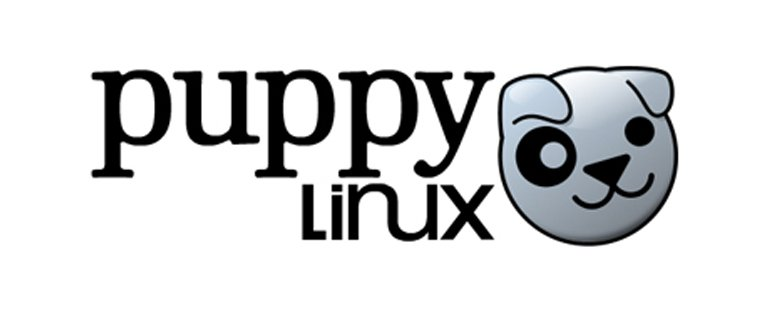

# Puppy Linux 🚀

O **Puppy Linux** é uma distribuição Linux ultra-leve, projetada para computadores antigos ou hardware limitado, oferecendo inicialização rápida, portabilidade e uso em RAM.

---

## 🔹 Principais Características

| Característica | Descrição | Badge |
|----------------|-----------|-------|
| **Leveza** | Ocupa menos de 300 MB, funciona com 128 MB de RAM |  |
| **Boot rápido** | Inicia em segundos, direto de CD/DVD/USB |  |
| **Modo Live** | Funciona sem instalação, ou instalação frugal |  |
| **Gerenciamento de pacotes** | Usa PET/SFS, algumas versões compatíveis com .deb ou .rpm |  |
| **Customização** | Modular, roda na RAM, fácil adicionar/remover pacotes |  |
| **Portabilidade** | Pode ser usado em pendrive ou CD removível |  |

---

## 🔹 Público-alvo 🎯
- Computadores antigos ou com hardware limitado.
- Usuários que precisam de um **sistema portátil**.
- Resgate de dados, manutenção e testes de hardware.
- **Não recomendado** para jogos pesados ou software moderno complexo.

---

## 🔹 Comparativo de Versões 🐾

| Versão | Base | RAM mínima | Tamanho ISO | Pacotes suportados | Ideal para |
|--------|------|-----------|-------------|------------------|------------|
| **Slacko Puppy** | Slackware | 128 MB | ~300 MB | PET / SFS | Computadores muito antigos |
| **TahrPup** | Ubuntu 14.04 LTS | 256 MB | ~400 MB | PET / .deb | Hardware antigo / compatibilidade Ubuntu |
| **BionicPup** | Ubuntu 18.04 LTS | 512 MB | ~500 MB | PET / .deb | Computadores mais recentes / software moderno leve |

---

## 🔹 Conclusão 📝
O Puppy Linux é como um **pequeno e veloz mascote Linux**:
- Leve, rápido e portátil.
- Perfeito para reviver computadores antigos ou criar **sistemas de teste**.
- Ideal para quem quer Linux funcional sem complicações e **uso em RAM**.

---

## 🔹 Recursos úteis 🔗
- Site oficial: [https://puppylinux.com](https://puppylinux.com)  
- Documentação: [https://puppylinux.com/wikka/HomePage](https://puppylinux.com/wikka/HomePage)  
- Comunidade ativa para suporte, plugins e atualizações.