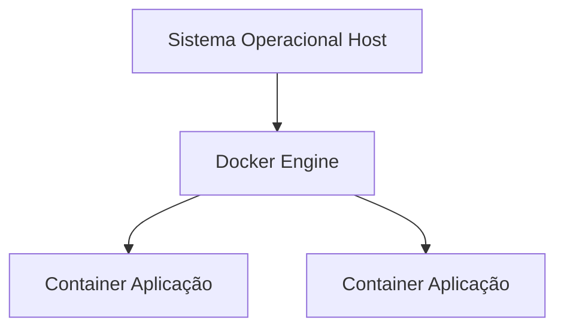
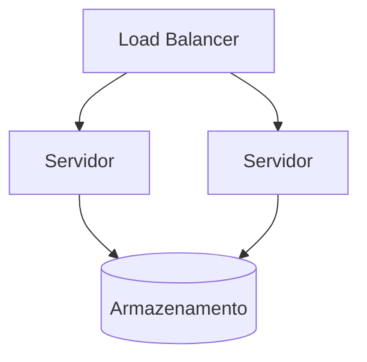
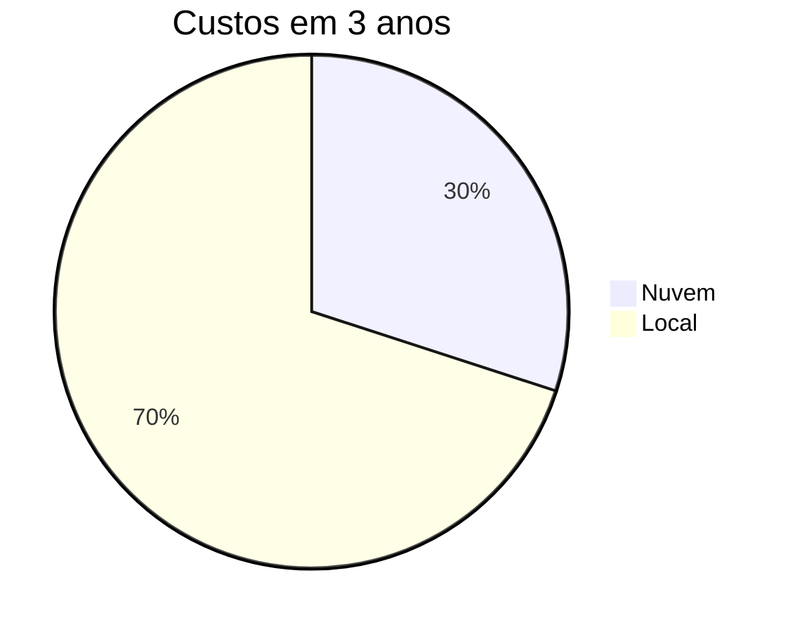

# RELATÓRIO – PROPOSTA DE ARQUITETURA DE INFRAESTRUTURA

## Estudo de Caso I – Sistemas Operacionais

---

## 1. Introdução

A empresa DevStore apresenta limitações relacionadas à escalabilidade, organização e segurança de sua infraestrutura de tecnologia da informação, decorrentes da ausência de padronização e de um fluxo estruturado de desenvolvimento.

Este documento propõe uma arquitetura baseada em:

* Pipeline de desenvolvimento (CI/CD)
* Ambientes isolados
* Containerização
* Computação em nuvem
* Segurança e monitoramento

Além disso, este relatório destaca o papel fundamental dos sistemas operacionais na implementação e funcionamento dessa arquitetura.

---

## 2. Problemas Identificados

| Problema              | Impacto                        |
| --------------------- | ------------------------------ |
| Falta de padronização | Inconsistência entre ambientes |
| Ausência de testes    | Falhas em produção             |
| Infraestrutura local  | Baixa escalabilidade           |
| Falta de isolamento   | Conflitos entre sistemas       |
| Ausência de controle  | Dificuldade de manutenção      |

---

## 3. Papel dos Sistemas Operacionais na Solução

Os sistemas operacionais desempenham papel central na arquitetura proposta, atuando como camada responsável pelo gerenciamento de recursos, isolamento de processos e suporte à execução das aplicações.

### 3.1 Gerenciamento de Recursos

O sistema operacional é responsável por controlar:

* Uso de CPU
* Alocação de memória
* Gerenciamento de arquivos
* Controle de dispositivos de entrada e saída

Na proposta apresentada, o sistema operacional garante que múltiplos containers ou máquinas virtuais utilizem os recursos de forma eficiente, evitando desperdícios e conflitos.

---

### 3.2 Isolamento de Processos

Um dos principais conceitos de sistemas operacionais aplicados é o isolamento.

* Em ambientes tradicionais: processos compartilham o mesmo sistema
* Em ambientes modernos: o isolamento é reforçado por containers e máquinas virtuais

Containers utilizam mecanismos do sistema operacional, como namespaces e controle de grupos de recursos, para isolar aplicações mesmo compartilhando o mesmo kernel ([Netdata][1])

Já máquinas virtuais utilizam um hipervisor e executam sistemas operacionais independentes, garantindo isolamento completo entre ambientes ([TechTarget][2])

---

### 3.3 Virtualização

A virtualização é uma extensão do conceito de abstração do sistema operacional.

#### Tipos utilizados:

* Virtualização completa (VMs)
* Virtualização leve (containers)

Nas máquinas virtuais:

* cada instância possui seu próprio sistema operacional
* maior isolamento
* maior consumo de recursos

Nos containers:

* compartilham o kernel do sistema operacional hospedeiro
* são mais leves e rápidos
* permitem maior escalabilidade ([TechTarget][2])

---

### 3.4 Sistema Operacional em Containers

Na arquitetura proposta:

* existe um sistema operacional base (host)
* sobre ele roda o Docker
* os containers utilizam esse mesmo sistema operacional

Isso significa que o sistema operacional:

* atua como base comum
* fornece chamadas de sistema (syscalls)
* gerencia processos isolados

---

### 3.5 Sistema Operacional na Nuvem

Na computação em nuvem, o sistema operacional continua sendo essencial, porém abstraído:

* servidores físicos executam um sistema operacional host
* máquinas virtuais possuem seus próprios sistemas operacionais
* containers compartilham o sistema operacional do host

Essa estrutura permite:

* elasticidade
* distribuição de carga
* alta disponibilidade

---

## 4. Arquitetura Proposta

### 4.1 Fluxo de Desenvolvimento

---

### 4.2 Arquitetura de Execução

---

### 4.3 Arquitetura em Nuvem

---

## 5. Comparação Técnica

| Critério       | Nuvem + Containers | Local      |
| -------------- | ------------------ | ---------- |
| Uso do SO      | Compartilhado      | Individual |
| Eficiência     | Alta               | Média      |
| Isolamento     | Controlado         | Limitado   |
| Escalabilidade | Alta               | Baixa      |

---

## 6. Comparação Financeira

---

## 7. Análise Integrada

A arquitetura proposta demonstra que o sistema operacional não é apenas um componente de suporte, mas sim o núcleo responsável por:

* garantir isolamento entre aplicações
* gerenciar recursos computacionais
* possibilitar virtualização e containerização
* sustentar a execução em nuvem

A utilização de containers representa uma evolução direta dos conceitos clássicos de sistemas operacionais, permitindo maior eficiência e escalabilidade sem a necessidade de múltiplos sistemas operacionais completos.

---

## 8. Conclusão

A solução proposta moderniza a infraestrutura da DevStore ao integrar conceitos fundamentais de sistemas operacionais com tecnologias contemporâneas.

Os sistemas operacionais atuam como elemento central da arquitetura, possibilitando:

* controle eficiente de recursos
* isolamento seguro de aplicações
* execução consistente em múltiplos ambientes
* suporte à escalabilidade em nuvem

Dessa forma, a proposta não apenas resolve os problemas identificados, mas também demonstra a aplicação prática dos conceitos teóricos de sistemas operacionais em um cenário real.

---

