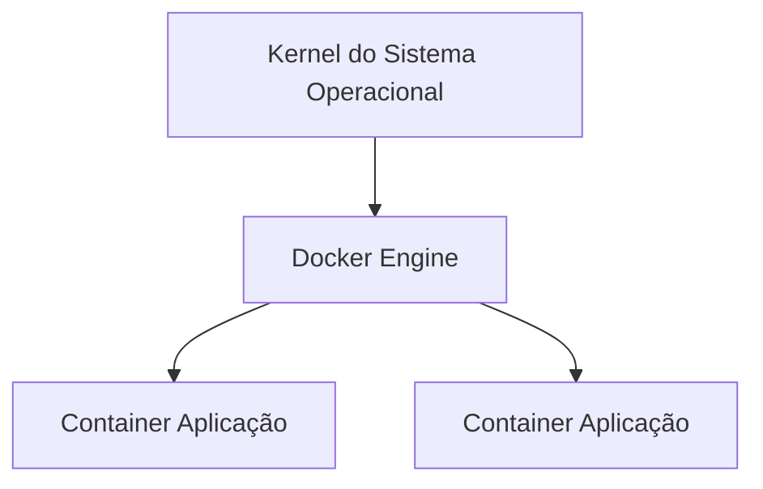
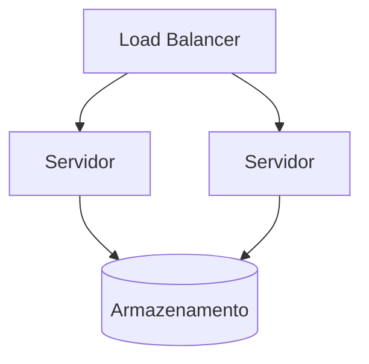
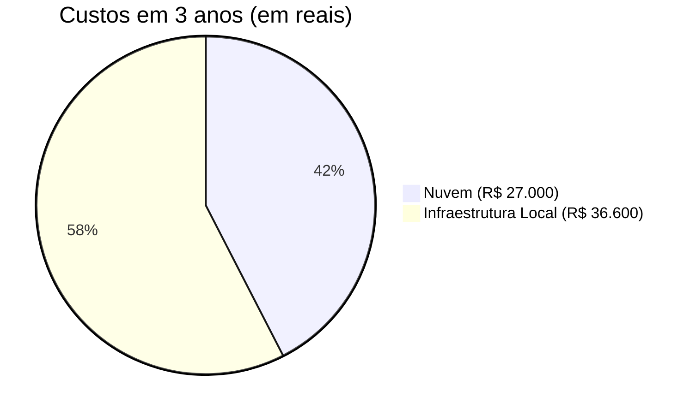

# RELATÓRIO – PROPOSTA DE ARQUITETURA DE INFRAESTRUTURA

## Estudo de Caso I – Sistemas Operacionais

---

## 1. Introdução

A empresa DevStore apresenta limitações relacionadas à escalabilidade, organização e segurança de sua infraestrutura de tecnologia da informação. Esses problemas decorrem principalmente da ausência de padronização dos ambientes e da inexistência de um fluxo estruturado de desenvolvimento e entrega de software.

Este documento propõe uma arquitetura moderna baseada em:

* Pipeline de desenvolvimento contínuo (CI/CD)
* Ambientes isolados
* Containerização
* Computação em nuvem
* Segurança e monitoramento

Além disso, o relatório evidencia o papel central dos sistemas operacionais como elemento fundamental para viabilizar essa arquitetura, conectando conceitos teóricos a aplicações práticas.

---

## 2. Problemas Identificados

| Problema              | Impacto técnico                        |
| --------------------- | -------------------------------------- |
| Falta de padronização | Divergência entre ambientes (dev/prod) |
| Ausência de testes    | Aumento de falhas em produção          |
| Infraestrutura local  | Baixa escalabilidade                   |
| Falta de isolamento   | Conflitos entre aplicações             |
| Ausência de controle  | Dificuldade de manutenção e evolução   |

---

## 3. Papel dos Sistemas Operacionais na Solução

Os sistemas operacionais atuam como a camada responsável pela abstração de hardware, gerenciamento de recursos e controle da execução de processos, sendo essenciais para garantir eficiência, isolamento e previsibilidade no ambiente proposto.

---

### 3.1 Gerenciamento de Recursos

O sistema operacional controla:

* Escalonamento de CPU (process scheduling)
* Alocação de memória
* Gerenciamento de arquivos
* Controle de dispositivos de entrada/saída

Na arquitetura proposta, essas funções são fundamentais para permitir a execução simultânea de múltiplos containers e serviços durante o pipeline CI/CD.

Por exemplo:

* Durante o processo de build e testes automatizados, múltiplos processos concorrem por CPU e memória
* O sistema operacional garante concorrência controlada, evitando starvation e garantindo desempenho previsível

---

### 3.2 Isolamento de Processos

O isolamento é um dos pilares da solução proposta.

Em sistemas tradicionais:

* Processos compartilham o mesmo ambiente com menor controle

Na arquitetura moderna:

* O isolamento é reforçado por mecanismos do sistema operacional

Nos containers, o isolamento é obtido por:

* **Namespaces** → isolam visão de recursos (processos, rede, sistema de arquivos)
* **Control Groups (cgroups)** → limitam uso de CPU, memória e I/O

Isso permite que múltiplas aplicações executem de forma independente, mesmo compartilhando o mesmo kernel.

Já em máquinas virtuais:

* Cada instância possui seu próprio sistema operacional
* O isolamento ocorre em nível de hardware virtualizado via hipervisor

---

### 3.3 Virtualização

A virtualização é uma extensão direta do conceito de abstração do sistema operacional.

#### Tipos utilizados:

**1. Máquinas Virtuais (Virtualização completa)**

* Virtualizam o hardware
* Executam sistemas operacionais independentes
* Maior isolamento
* Maior consumo de recursos

**2. Containers (Virtualização leve)**

* Virtualizam o sistema operacional
* Compartilham o kernel do host
* Menor overhead
* Maior eficiência e escalabilidade

Diferença fundamental:

> Máquinas virtuais abstraem o hardware; containers abstraem o sistema operacional.

---

### 3.4 Sistema Operacional em Containers

Na arquitetura proposta:

* Existe um sistema operacional host
* O Docker atua como intermediário
* Os containers utilizam o mesmo kernel

Estrutura conceitual:

```
Sistema Operacional (Host)
 └── Kernel
      ├── Namespaces
      ├── cgroups
      └── Docker Engine
           ├── Container A
           └── Container B
```

Nesse modelo, o sistema operacional:

* Fornece chamadas de sistema (syscalls)
* Gerencia processos isolados
* Controla uso de recursos

---

### 3.5 Sistema Operacional na Nuvem

Na computação em nuvem, o sistema operacional permanece essencial, porém parcialmente abstraído.

Camadas:

* Hardware físico
* Sistema operacional host
* Hipervisor (quando aplicável)
* Máquinas virtuais ou containers

Essa arquitetura permite:

* Elasticidade (escala sob demanda)
* Balanceamento de carga
* Alta disponibilidade

---

## 4. Arquitetura Proposta

---

### 4.1 Fluxo de Desenvolvimento (CI/CD)


Relação com o sistema operacional:

* Cada etapa executa como processos independentes
* O SO gerencia concorrência, memória e I/O
* Garante execução previsível e isolada

---

### 4.2 Arquitetura de Execução



---

### 4.3 Arquitetura em Nuvem



---

## 5. Comparação Técnica

| Critério       | Nuvem + Containers      | Infraestrutura Local |
| -------------- | ----------------------- | -------------------- |
| Uso do SO      | Compartilhado (kernel)  | Isolado por máquina  |
| Eficiência     | Alta                    | Média                |
| Isolamento     | Controlado (namespaces) | Limitado             |
| Escalabilidade | Alta                    | Baixa                |
| Overhead       | Baixo                   | Alto                 |

---

## 6. Comparação Financeira

Análise baseada em um cenário realista considerando serviços em nuvem e infraestrutura local ao longo de 3 anos.

### Fontes de referência de preços:

* Amazon Web Services (estimativas de EC2, RDS e S3 – região América do Sul)
* Google Cloud Platform (valores comparativos de mercado)
* Mercado Livre e Kabum! (preços de servidores e hardware)
* Tarifas médias de energia elétrica no Brasil (ANEEL)
* Planos de internet empresarial (provedores nacionais)

---

### Custos estimados

**Nuvem:**

* Instâncias (compute): R$ 300/mês
* Banco de dados gerenciado: R$ 250/mês
* Armazenamento: R$ 100/mês
* Transferência de dados: R$ 100/mês

**Total mensal:** R$ 750
**Total em 3 anos:** R$ 27.000

---

**Infraestrutura Local:**

* Servidor inicial: R$ 12.000
* Upgrade/manutenção: R$ 3.000

**Custos mensais:**

* Energia elétrica: R$ 250
* Internet empresarial: R$ 200
* Manutenção: R$ 150

**Total mensal:** R$ 600
**Total em 3 anos (operacional):** R$ 21.600

**Total geral (3 anos): R$ 36.600**

---

### Comparação



---

### Análise

Apesar do custo mensal da nuvem ser mais elevado, a infraestrutura local apresenta maior custo total devido ao investimento inicial e custos operacionais contínuos.

Além disso, a computação em nuvem oferece vantagens estratégicas como escalabilidade, elasticidade e alta disponibilidade, convertendo investimentos de capital (CAPEX) em despesas operacionais (OPEX).

---

## 7. Análise Integrada

A arquitetura proposta evidencia que o sistema operacional é o núcleo da infraestrutura moderna, sendo responsável por:

* Gerenciamento eficiente de recursos
* Execução concorrente de processos
* Isolamento entre aplicações
* Suporte à virtualização e containerização

---

## 8. Conclusão

A proposta apresentada moderniza a infraestrutura da DevStore ao integrar práticas contemporâneas com fundamentos sólidos de sistemas operacionais.

O sistema operacional deixa de ser apenas uma camada de suporte e passa a ser o elemento central da arquitetura, possibilitando:

* Execução eficiente e concorrente de aplicações
* Isolamento seguro
* Padronização de ambientes
* Escalabilidade em nuvem

Dessa forma, a solução resolve os problemas identificados e demonstra a aplicação prática de conceitos fundamentais de sistemas operacionais em um cenário real de engenharia de software.

---
